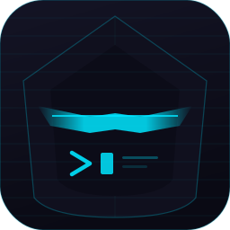

<div align="center">
  
</div>

# StealthTerm

[](./README.md) | [](./README_zh.md)

一款用 Rust 打造的简洁、高效的现代化终端模拟器。

## ✨ 为什么选择 StealthTerm？

StealthTerm 旨在提供**无干扰的纯净终端体验**。我们移除了传统的菜单栏，将所有注意力集中在终端内容本身。项目核心功能已具备，未来将持续迭代，为你带来更多实用特性。

## 🚀 当前特性

- [x] 极简界面：无菜单栏，无标题栏，侧边栏可折叠，最大化内容显示区域
- [x] 终端仿真： 完整的 xterm-256color 支持，ANSI 颜色、光标控制、滚动区域、TrueColor
- [x] SSH 连接管理： 侧边栏连接树，支持分组、拖拽排序、AES-256-GCM 加密凭据存储
- [x] SFTP 文件管理器：双栏本地/远程文件浏览器，传输队列与进度显示，支持文件拖拽上传
- [x] Zmodem：自动检测 rz/sz 命令进行文件传输，同样支持文件拖拽上传
- [x] 服务器监控：状态栏实时显示 SSH 会话的 CPU、内存、磁盘和网络状态
- [x] 多语言界面：支持英文和中文（设置 → 语言，运行时切换）
- [x] 多标签页管理：轻松在多个会话间切换
- [x] 主题系统：内置Dracula主题（默认）
- [x] Chrome 风格标签页：右键菜单、标签复制
- [x] 分屏：水平和垂直分屏，可拖拽调整比例
- [x] 批量执行：同时向多个 SSH 会话发送命令
- [x] 历史命令补全：智能提示历史命令
- [x] 命令输出折叠：可折叠命令输出内容，并可一键复制输出内容
- [x] 锁屏：密码保护锁屏，支持空闲自动锁定
- [x] 跨平台：支持 Linux 和 Windows 和 macOS

## 🕹️ 技术栈

| 类别 | 技术 |
|------|------|
| 语言 | Rust (2024 edition) |
| GUI | egui + eframe (wgpu 渲染器) |
| SSH | russh + russh-keys |
| SFTP | russh-sftp |
| 终端 | portable-pty + vte |
| 异步 | tokio |
| 加密 | ring + zeroize |

## 🪁 构建

```bash
# 开发构建
cargo build

# 发布构建
cargo build --release

# Windows 交叉编译
cargo xwin build --target x86_64-pc-windows-msvc --release

# 运行测试
cargo test --workspace
```

## 🎨 配置

设置文件存储位置：
- Linux/MacOS: `~/.config/stealthterm/settings.toml`
- Windows: `%APPDATA%/stealthterm/settings.toml`

SSH 连接配置和加密凭据存储在同一目录下。


## 🧵 已知限制

- 尚不支持 堡垒机MFA多因子认证
- 尚不支持 SSH ProxyJump/端口转发
- 崩溃后会话恢复未实现
- 尚不支持 标签拖拽调整顺序
- SFTP 断点续传和速度显示未实现
- 尚不支持 自定义主题

## 🛠️ 开发路线图

我们正在以下方面持续优化项目：

**🖌️ 打磨与优化**
- [ ] 提升终端渲染效果
- [ ] 加强屏幕缩放稳定性
- [ ] 强化历史命令补全效果和折叠输出的稳定性
- [ ] 优化分屏功能
- [ ] 提升各个平台版本的兼容性
- [ ] 提高密码、密钥、历史命令存储的安全性
- [ ] 优化菜单、弹窗、窗口元素的美观度


**📋 规划中的功能**
- [ ] 会话保存与恢复
- [ ] 支持更多的自定义的配置项
- [ ] 做到真正的主题切换

**🧪 社区验证**
欢迎通过实际使用，帮助我们验证以下场景的稳定性：
- [ ] 在高分辨率/多显示器环境下的显示效果
- [ ] 长时间运行的内存/cpu占用情况
- [ ] 长时间运行是否出现闪退或崩溃的情况
- [ ] 在Windows平台之外的其他操作系统中的程序验证

## 🤝 参与贡献

StealthTerm 仍处于积极开发阶段，你的每一条反馈都至关重要。如果你发现了 Bug 或有任何功能建议，欢迎提交Issue或直接发起 Pull Request。

**让我们一起，打磨出一款真正好用的现代化终端软件。**

## 📄 许可证

StealthTerm 使用 MIT 开源协议。

保留所有权利。
